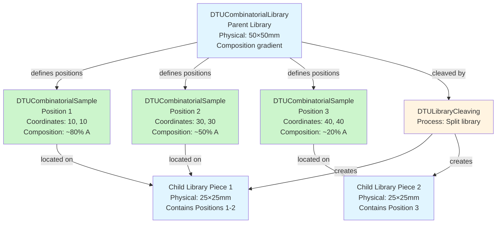

# Combinatorial Libraries Concept

A key concept in the nomad-dtu-nanolab-plugin is the distinction between **physical library pieces** and **logical sample positions**. Understanding this distinction is essential for working with combinatorial materials discovery workflows.

## The Core Distinction

### Combinatorial Libraries (Physical Objects)

A **combinatorial library** is a **physical substrate** with composition gradients or patterns created by multi-target deposition techniques like sputtering. It's an [entity](data-model.md#entities-physical-items-in-your-lab)—a tangible object you can hold and put on a shelf.

- **Physical dimensions**: Width, length, thickness
- **Lab ID**: Unique identifier for inventory tracking
- **Creation process**: Links to the [sputtering](../reference/sputtering.md) or [thermal evaporation](../reference/thermal.md) that made it
- **Can be cleaved**: Physically cut into smaller pieces for parallel processing

### Sample Positions (Measurement Coordinates)

A **sample position** is a **logical coordinate** on a combinatorial library representing a specific composition point. Sample positions are also [entities](data-model.md#entities-physical-items-in-your-lab) (referenceable, persistent), but they are **coordinate-based** rather than physical pieces.

- **Coordinates**: (x, y) position on the library
- **Composition**: Material composition at that location (if gradient exists)
- **References parent**: Links to the library (intact or cleaved piece) it's located on
- **Measurement target**: What you actually measure in characterization

!!! note "Key Insight"
    **Sample positions are defined by coordinates, not by cleaving.**

    - Cleaving creates **physical pieces** of the substrate
    - Sample positions remain **coordinates** on the original library
    - Multiple sample positions can exist on a single cleaved piece

## Visual Understanding

  

    
    
<em>Figure 1: A combinatorial library showing composition gradient across the substrate (e.g., from multi-target sputtering)</em>

  

  

    
    
<em>Figure 2: Sample positions (dots) mapped across the library - each represents a specific composition for measurement</em>

  

## Why This Distinction Matters

### Composition Gradients Are Spatial

Multi-target sputtering creates **continuous composition gradients** across the substrate:

- Target A at position 1, Target B at position 2
- Composition varies smoothly across the substrate
- Each (x, y) coordinate has a specific composition
- **Position = Composition**

### Cleaving Is Physical, Not Compositional

When you cleave a library, you're **physically dividing the substrate**, not redefining compositions:

- Original library: 50mm × 50mm
- Cleaved into 4 pieces: each 25mm × 25mm
- **But**: Composition gradient coordinate system remains unchanged
- Sample position at (30, 30) is still at (30, 30), whether on intact library or on a cleaved piece

### Measurements Reference Libraries, and Track Positions

When you do a mapping measurement on a library, you're measuring at a **specific coordinates (composition point)**:

## The Data Model in Practice

### Libraries Hierarchy

### Workflow Example

1. **Create library** via [sputtering](../reference/sputtering.md):
   - Input: Substrate, Target A, Target B
   - Output: DTUCombinatorialLibrary (50×50mm with gradient)

2. **Optional: Cleave library** for parallel processing:
   - Input: Parent library
   - Process: [DTULibraryCleaving](../reference/cleaving.md)
   - Output: 2 child libraries (physical pieces)
   - Sample positions **still reference their (x,y) coordinates**

3. **Measure at positions**:
   - [XRD](../reference/xrd.md) measurement
   - [XPS](../reference/xps.md) measurement
   - [PL](../reference/pl.md) measurement
   - Each measurement links to its sample position, which maintains coordinate information

4. **Aggregate and analyze**:
   - [Jupyter Analysis](../reference/analysis.md) collects data by position
   - Creates composition-property maps using coordinate information
   - Interpolates between measured positions if needed

## Composition Mapping Workflow

For libraries with composition gradients:

1. **Synthesis**: Multi-target [sputtering](../reference/sputtering.md) creates gradient
2. **Initial mapping**: [EDX](../reference/edx.md) or [XPS](../reference/xps.md) at several points to measure composition
3. **Interpolation**: Create composition map model (e.g., linear gradient, gaussian plume)
4. **Define positions**: Place sample positions at compositions of interest
5. **Optional cleaving**: Physically divide if needed for parallel work
6. **Comprehensive characterization**: Multiple techniques at each position
7. **Property mapping**: Correlate composition (from position) with properties (from measurements)

## Technical Implementation

In the schema:

- **DTUCombinatorialLibrary**: `CompositeSystem` entity with dimensions and synthesis provenance
- **DTUCombinatorialSample**: `CompositeSystem` entity with:
  - `coordinates`: (x, y) position on library
  - `reference_to_library`: Links to parent or child library
  - `composition`: Material composition at this position
- **DTULibraryCleaving**: `Process` activity that:
  - `input`: Parent library
  - `outputs`: Multiple child libraries (physical pieces)
  - Sample positions maintain their coordinate references

## Learn More

- **[Data Model Philosophy](data-model.md)**: Understanding entities vs. activities
- **[Materials Discovery Workflow](workflow.md)**: See how libraries fit into the complete workflow
- **[Reference: Samples](../reference/samples.md)**: Technical schema documentation for libraries and positions
- **[Reference: Library Cleaving](../reference/cleaving.md)**: Technical schema documentation for cleaving process
- **[Tutorial](../tutorial/tutorial.md)**: Hands-on practice with combinatorial libraries
