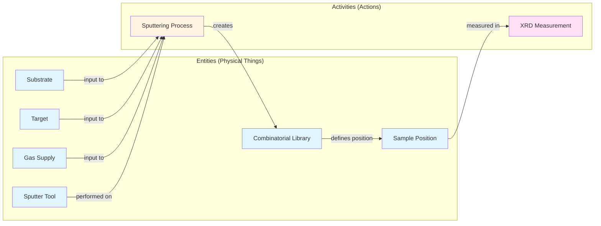

# Data Model Philosophy

The nomad-dtu-nanolab-plugin organizes data following a clear conceptual framework: **Entities** are physical things in your lab, while **Activities** are the processes and measurements you perform. This distinction, rooted in the Basic Formal Ontology (BFO), provides a consistent structure for capturing the entire materials discovery workflow.

## Why This Matters

Having a consistent way to organize data means:

- **Queries work intuitively**: "Find all XRD measurements on samples from sputtering run #42"
- **Provenance is automatic**: Every sample links back to how it was made
- **Workflows integrate**: NOMAD knows how to connect processes, samples, and measurements
- **Your data is reusable**: Standard structures make data shareable and machine-readable

## The Basic Formal Ontology Foundation

The [Basic Formal Ontology (BFO)](https://basic-formal-ontology.org/){:target="_blank" rel="noopener"} is a top-level ontology that provides fundamental categories for organizing information. Don't worry—you don't need to understand formal ontology to use these schemas! The key insight BFO provides is this simple distinction:

- **Continuants** (aka Entities): Things that persist over time and can be present at multiple time points
- **Occurrents** (aka Activities): Processes or events that unfold over time and happen at specific times

In practice, this maps perfectly to laboratory work:

- **Entities** = Physical items you can put on a shelf or reference later
- **Activities** = Actions you perform that have a start time and end time

## Entities: Physical Items in Your Lab

**Entities** are things that exist and persist over time—the physical items you handle in the lab. In the nomad-dtu-nanolab-plugin, entities include:

### Sample-Related Entities
- **[Samples and Libraries](../reference/samples.md)** - The materials you create and study (DTUCombinatorialLibrary, DTUCombinatorialSample)
- **[Substrates](../reference/substrates.md)** - The base materials you deposit on (DTUSubstrate, DTUSubstrateBatch)

### Consumable Materials
- **[Targets](../reference/targets.md)** - Sputter deposition sources (DTUTarget)
- **[Gas Supplies](../reference/gas.md)** - Gas cylinders and supplies (DTUGasSupply)

### Equipment
- **[Instruments](../reference/instruments.md)** - Equipment in your lab (DTUInstrument)

### Common Entity Features

All entities in the plugin extend NOMAD's `Entity` base class, which provides:

- **Unique lab IDs**: Every entity has a lab-specific identifier for tracking
- **Referenceable**: Entities can be linked from multiple activities
- **Persistent**: Entities exist before, during, and after activities
- **Searchable**: NOMAD indexes entities for easy finding
- **Provenance tracking**: Links to the activities that created them

!!! example "Entity Example"
    A substrate wafer is an entity:

    - It exists before you use it
    - You can reference it from multiple sputtering processes
    - It persists (in principle) after use
    - It has a unique lab ID (e.g., "SI-BATCH-2024-03-15")

## Activities: Things You Do in the Lab

**Activities** are processes, measurements, and analyses—the actions you perform. Activities have start and end times, consume inputs, and produce outputs.

### Synthesis and Processing
- **Synthesis Processes** - Making samples ([Sputtering](../reference/sputtering.md), [RTP](../reference/rtp.md), [Thermal Evaporation](../reference/thermal.md))
- **Sample Processing** - Splitting libraries ([Library Cleaving](../reference/cleaving.md))

### Measurements
- **Characterization** - Measurement techniques ([XRD](../reference/xrd.md), [XPS](../reference/xps.md), [EDX](../reference/edx.md), [PL](../reference/pl.md), [Ellipsometry](../reference/ellipsometry.md), [Raman](../reference/raman.md), [RT](../reference/rt.md))

### Analysis
- **Data Processing** - Computational analysis ([Jupyter Analysis](../reference/analysis.md))

### Common Activity Features

All activities extend NOMAD's `Activity` base classes (`Process`, `Measurement`, `Analysis`), which provide:

- **Datetime tracking**: When the activity started and ended
- **Input/output links**: What entities went in and came out
- **Workflow integration**: NOMAD automatically creates workflow graphs
- **Result normalization**: Standard places for results and data
- **Operator tracking**: Who performed the activity

!!! example "Activity Example"
    A sputtering deposition is an activity:

    - It occurs at a specific time (e.g., "2024-03-15 from 14:00 to 16:30")
    - It consumes inputs (substrates, targets, gases)
    - It produces outputs (a combinatorial library)
    - It uses instruments (the sputter tool)
    - Once it's done, it's complete—you can't "see" the process later, only its results

## How Entities and Activities Connect

The power of this framework comes from how entities and activities link together:

### Complete Provenance Chain

Every sample in NOMAD can trace its complete history:

1. **Entities used**: Which specific substrate, targets, and gases?
2. **Process details**: What were the deposition parameters?
3. **Output created**: The resulting library or sample
4. **Measurements performed**: All characterization data
5. **Analysis conducted**: Computational processing and interpretation

This complete chain enables:

- **Reproducibility**: Exact conditions for recreation
- **Troubleshooting**: Identify what changed when results differ
- **Optimization**: Correlate parameters with properties
- **Publications**: Complete methods section from metadata

## Design Principles for Plugin Schemas

When the plugin defines new schemas, they follow these principles:

1. **Physical items extend Entity**: If it's something you can label and put on a shelf, it's an entity
2. **Processes and measurements extend Activity**: If it happens at a specific time and produces results, it's an activity
3. **Activities reference entities**: Inputs, outputs, and instruments are all entities
4. **Entities don't reference specific activities**: A substrate doesn't "know" which processes will use it (but NOMAD can query this)

## Practical Guidelines

### When creating a new schema, ask:

**Is this a physical thing that persists?** → Make it an **Entity**

- Has a lab ID for inventory tracking
- Can be referenced by multiple activities
- Examples: substrates, samples, instruments

**Is this something that happens at a specific time?** → Make it an **Activity**

- Has datetime stamps
- Links to input and output entities
- Examples: synthesis, measurements, analysis

### For data entry:

1. **Create entities first**: Set up substrates, targets, instruments in inventory
2. **Document activities**: Record processes with links to entities
3. **Let NOMAD connect**: Workflow graphs are auto-generated from links

## Relation to NOMAD Base Sections

The plugin builds on NOMAD's [base sections](https://nomad-lab.eu/prod/v1/staging/docs/explanation/base_sections.html#datamodelmetainfobasesections){:target="_blank" rel="noopener"}:

- `Entity` → Base for all persistent things
- `Activity` → Base for all time-bound events
  - `Process` → For synthesis and preparation
  - `Measurement` → For characterization
  - `Analysis` → For computational work

The DTU schemas extend these with domain-specific fields while preserving the standard structure.

## Learn More

- **[Materials Discovery Workflow](workflow.md)**: See how entities and activities connect in a complete workflow
- **[Combinatorial Libraries](combinatorial-libraries.md)**: Understand the sample position concept, a key entity in the plugin
- **[Reference Documentation](../reference/index.md)**: Technical details of each schema
- **[Basic Formal Ontology](https://basic-formal-ontology.org/){:target="_blank" rel="noopener"}**: Deep dive into the ontological foundation (advanced)
