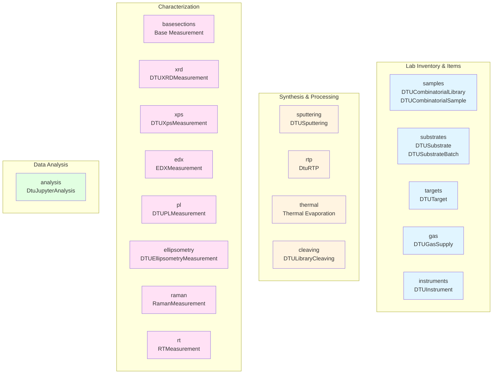
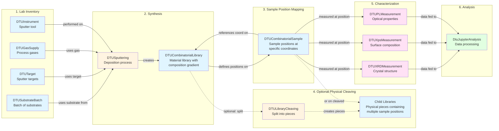

# Materials Discovery Workflow

This page illustrates how the nomad-dtu-nanolab-plugin schemas connect in a complete materials discovery workflow, from lab inventory through synthesis, characterization, and analysis. Understanding this flow helps you see how individual schemas work together to capture the entire research process.

## Schema Package Organization

The plugin contains 17 schema packages organized by function. This organization mirrors the natural workflow progression in the lab:

**Color coding:**
- 🔵 **Blue** = Lab Inventory & Items ([Entities](data-model.md#entities-physical-items-in-your-lab))
- 🟡 **Yellow** = Synthesis & Processing ([Activities](data-model.md#activities-things-you-do-in-the-lab))
- 🔴 **Pink** = Characterization ([Activities](data-model.md#activities-things-you-do-in-the-lab))
- 🟢 **Green** = Data Analysis ([Activities](data-model.md#activities-things-you-do-in-the-lab))

## End-to-End Workflow Example

Here's how these schemas connect in a typical DTU Nanolab workflow, from inventory to analysis:

!!! note "Key Workflow Concepts"
    - **Sample positions** (DTUCombinatorialSample) are defined by **coordinates** on libraries, not by physical cleaving
    - **Cleaving** (optional) creates **physical pieces** (child libraries) for parallel processing
    - **Measurements** reference libraries and track their coordinates, whether on intact libraries or cleaved pieces
    - A single cleaved piece can contain **multiple sample positions** at different compositions

## Workflow Stages Explained

### 1. Lab Inventory Setup

Before starting experiments, you document your lab's resources:

- **[Substrate batches](../reference/substrates.md)**: Catalog wafers/substrates with batch numbers and properties
- **[Targets](../reference/targets.md)**: Document sputter targets with composition and usage tracking
- **[Gas supplies](../reference/gas.md)**: Register gas cylinders with purity and cylinder numbers
- **[Instruments](../reference/instruments.md)**: Define lab equipment with capabilities and configurations

These are all **[entities](data-model.md#entities-physical-items-in-your-lab)**—persistent physical items with lab IDs.

### 2. Synthesis Process

You perform a **[synthesis activity](data-model.md#synthesis-and-processing)** that consumes inventory items and creates libraries:

- **[Sputtering](../reference/sputtering.md)**, **[Thermal Evaporation](../reference/thermal.md)**, or **[RTP](../reference/rtp.md)** processes
- **Inputs**: References to substrates, targets, gases, and instruments from inventory
- **Outputs**: Creates a **[combinatorial library](../reference/samples.md)** with composition gradients
- **Parameters**: Complete deposition/annealing conditions documented

The process extends NOMAD's `Process` activity class, automatically linking inputs and outputs.

### 3. Optional Physical Cleaving

If needed for parallel processing, you can physically divide the library:

- **[Library cleaving](../reference/cleaving.md)** process (DTULibraryCleaving) splits the substrate
- **Input**: Parent library
- **Outputs**: Multiple child libraries (physical pieces)
- **Sample positions remain unchanged**: They still reference their original coordinates
- Each cleaved piece typically contains multiple sample positions

Learn more about this distinction in [Combinatorial Libraries Concept](combinatorial-libraries.md).

### 4. Characterization Measurements

You perform **[measurement activities](data-model.md#measurements)** on several library coordinates:

- **Structural**: [XRD](../reference/xrd.md) for crystal structure and phases
- **Compositional**: [XPS](../reference/xps.md) and [EDX](../reference/edx.md) for elemental analysis
- **Optical**: [PL](../reference/pl.md), [Ellipsometry](../reference/ellipsometry.md), [Raman](../reference/raman.md)
- **Electrical**: [RT measurements](../reference/rt.md)

Each measurement:

- References the specific library and track coordinates
- Links to the instrument used
- Stores measurement parameters and results
- Extends the common [BaseMeasurement](../reference/basesections.md) infrastructure

See [Characterization Techniques](characterization.md) for what each technique provides.

### 5. Data Analysis

Finally, you process and interpret the data:

- **[Jupyter Analysis](../reference/analysis.md)** (DtuJupyterAnalysis) for computational workflows
- **Inputs**: References to libraries and their provenance
- **Outputs**: Processed results, figures, derived properties
- **Notebook integration**: Links to Jupyter notebooks with analysis code

The analysis activity completes the provenance chain: inventory → synthesis → samples → measurements → analysis.

This workflow structure provides:

1. **Reproducibility**: Exact conditions documented for every sample
2. **Traceability**: Query any sample's complete history
3. **Efficiency**: Reuse inventory items across many experiments
4. **Analysis**: Correlate synthesis parameters with measured properties
5. **Publications**: Auto-generate methods sections from metadata
6. **Collaboration**: Share complete provenance with collaborators

## Learn More

- **[Data Model Philosophy](data-model.md)**: Understand entities vs. activities
- **[Combinatorial Libraries](combinatorial-libraries.md)**: Deep dive into sample positions
- **[Characterization Techniques](characterization.md)**: What each measurement tells you
- **[Tutorial](../tutorial/tutorial.md)**: Hands-on walkthrough of a complete workflow
- **[Reference](../reference/index.md)**: Technical schema documentation
