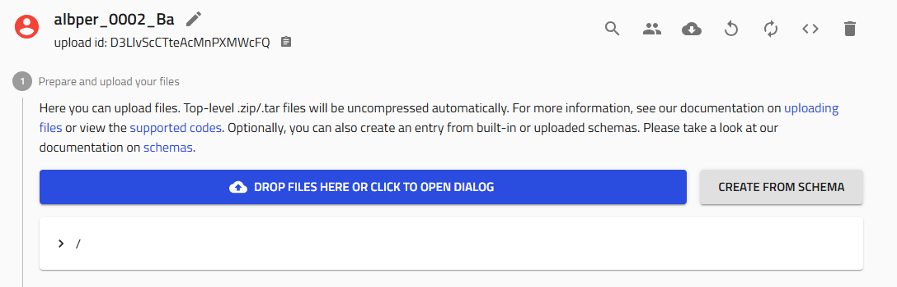
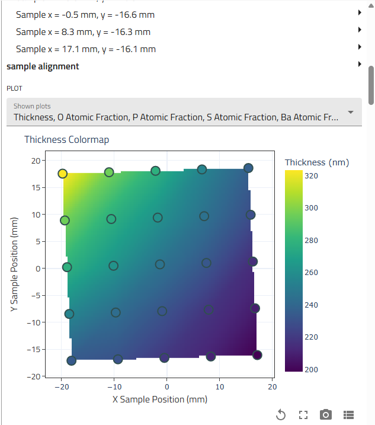

# Add EDX Measurements

This guide explains how to add Energy-Dispersive X-ray Spectroscopy (EDX) composition measurements to your combinatorial library in NOMAD Oasis.

## Overview

EDX provides elemental composition at specific points on your sample. This guide shows you how to:

- Create an EDX measurement entry
- Upload Excel data files
- Review auto-generated plots
- Clean up invalid data points

## Prerequisites

Before starting, you need:

- **Completed sputtering upload** with combinatorial libraries
- **EDX Excel files** - One per measured piece/quarter
- **Knowledge of which quarter** you measured (BL, BR, FL, FR)

!!! info "File Format"
    Your Excel files should contain position coordinates and elemental compositions for each measurement point.

## Step 1: Navigate to Your Upload

1. Go to the **sputtering upload** where your combinatorial libraries were created

2. Click on the upload to open it

   

!!! tip "Finding Your Upload"
    Use the search function or filter by your username to quickly locate your uploads.

## Step 2: Create EDX Measurement Entry

### 2.1 Start Schema Creation

Click **"Create from schema"** in your upload.


### 2.2 Name and Select Schema

Follow the naming convention:

```
username_####_Material_Quarter_EDX
```

Examples:

- `amazingresearcher_0042_CuZn_BR_EDX` (back right quarter)
- `username_0123_BaZr_FL_EDX` (front left quarter)

**Select the schema:**

- Choose **"EDX Measurement"** from the Built-in schemas dropdown


Click **"Create"**.



## Step 3: Upload EDX Data

### 3.1 Locate the File Upload Field

Scroll down to find the **"EDX file"** field.

### 3.2 Upload Your Excel File

1. Click the upload area or drag and drop your Excel file

2. **IMPORTANT: Click "Save"** immediately after the file uploads

   

!!! danger "Must Save!"
    Failing to save after uploading will result in data loss. Always click "Save" after file uploads.


!!! info "Processing Time"
    NOMAD processes the file and extracts:

    - Measurement positions (x, y coordinates)
    - Elemental compositions (atomic %)
    - Relationships to the combinatorial library geometry

## Step 4: Review Results

### 4.1 Navigate to Results Subsection

Scroll down to find the small **"Results"** subsection and expand it.

### 4.2 Examine Auto-Generated Plots

NOMAD automatically generates visualizations showing:

- Composition vs. position
- Elemental distributions across the measured area
- Individual data points overlaid on the sample geometry


All measurement points from your Excel file are displayed in the graphs below.

## Step 5: Clean Invalid Data Points

During EDX mapping, you might accidentally measure:

- Areas with no film (bare substrate)
- Wrong sample regions
- Contamination spots

These invalid points should be removed.

### 5.1 Identify Bad Points

Review the plots and identify suspicious data:

- Compositions far from expected values
- Points in regions you didn't deposit
- Outliers inconsistent with neighboring points

### 5.2 Delete Invalid Points

1. Locate the data point in the list (usually shown with coordinates)

2. Click the **trash can icon** next to the invalid point

3. **Click "Save"** after each deletion



!!! warning "Save After Each Deletion"
    Changes aren't final until you save. Always click "Save" after removing points.

### 5.3 Re-check Plots

After removing invalid points, scroll back to the Results section to verify:

- Plots show cleaner composition gradients
- Outliers are removed
- Data makes physical sense

## Step 6: Repeat for Additional Quarters

If you measured multiple quarters of your combinatorial library, repeat this entire process for each quarter:

1. Create a new EDX Measurement entry with the appropriate quarter name:
   - `username_####_Material_BR_EDX`
   - `username_####_Material_BL_EDX`
   - `username_####_Material_FL_EDX`
   - `username_####_Material_FR_EDX`

2. Upload the corresponding Excel file

3. Review and clean data points

!!! tip "Mapping Strategy"
    Quarters are commonly measured individually. This allows:

    - Dedicating quarters to different techniques
    - Focusing EDX on interesting composition regions
    - Parallel processing of characterization

## Verification Checklist

After uploading EDX data, verify:

- [ ] Entry named correctly with quarter identifier
- [ ] Excel file uploaded successfully
- [ ] Results subsection shows plots
- [ ] Data points appear in expected positions
- [ ] Invalid points removed
- [ ] Final save completed
- [ ] Composition gradients look reasonable

## Troubleshooting

### No plots appear in Results section

**Problem**: Results subsection is empty or shows errors

**Solutions**:

- Check Excel file format - ensure it matches expected structure
- Verify file uploaded successfully (no error messages)
- Refresh the page and check again
- Confirm you clicked "Save" after upload

### Can't delete data points

**Problem**: Trash icon missing or not working

**Solutions**:

- Make sure you're in edit mode (not just viewing)
- Try refreshing the page
- Check you have write permissions on the upload
- Verify the entry isn't locked or published

### Wrong data appears in plots

**Problem**: Plots show unexpected composition values or positions

**Solutions**:

- Verify you uploaded the correct Excel file
- Check if the file corresponds to the correct quarter
- Ensure Excel file wasn't corrupted or modified
- Confirm measurement positions match library geometry

### Excel file won't upload

**Problem**: File rejected or error during upload

**Solutions**:

- Verify file is in Excel format (.xlsx or .xls)
- Check file size isn't too large (typically <5 MB)
- Ensure file isn't password-protected
- Try opening in Excel to verify it's not corrupted
- Re-export from your EDX analysis software

## Understanding EDX Data

### What does EDX measure?

EDX provides:

- **Elemental composition** at each measurement point (atomic % or weight %)
- **Spatial distribution** of elements across your sample
- **Composition gradients** created by multi-target sputtering

### Measurement considerations:

- **Penetration depth**: EDX samples several microns deep
- **Spatial resolution**: Typically ~1 micron lateral resolution
- **Light element detection**: Limited sensitivity for elements lighter than carbon
- **Surface sensitivity**: Surface contamination can affect results

### Data interpretation:

The visualizations help you:

- Identify composition ranges achieved in your library
- Locate specific compositions of interest
- Track gradient directions and magnitudes
- Validate against target compositions

## Next Steps

After adding EDX measurements:

1. **[Plot Combinatorial EDX Data](plot-combinatorial-edx.md)** - Visualize the full library
2. **[Add XRD Measurements](add-xrd-measurements.md)** - Add structural characterization
3. **[Add Other Characterization](../reference/index.md)** - XPS, PL, Ellipsometry, etc.

## Related Resources

- [Upload Sputtering Data](upload-sputtering-data.md) - Create the parent combinatorial library
- [EDX Reference](../reference/edx.md) - Detailed schema documentation
- [Tutorial](../tutorial/tutorial.md) - Complete workflow example
- [Combinatorial Libraries](../explanation/combinatorial-libraries.md) - Understanding the data model

## Need Help?

If you encounter issues:

- Ask colleagues who have successfully uploaded EDX data
- Review example uploads in your group
- Check the [Reference Documentation](../reference/edx.md)
- Contact DTU Nanolab NOMAD support
