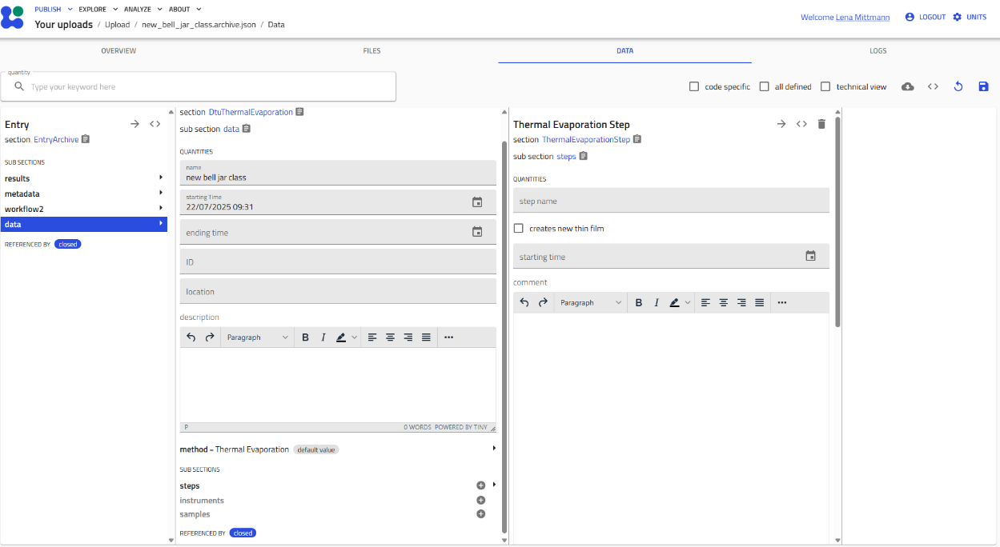

# Understanding NOMAD Schemas

This guide provides a detailed reference for navigating and using NOMAD schemas. Schemas are structured data templates that organize your experimental information consistently, enabling powerful search and analysis capabilities.

## What are Schemas?

NOMAD schemas define the structure of your data entries. They specify:

- **Required and optional fields** for your measurements
- **Data types** (numbers, text, references, etc.)
- **Relationships** between different entities (samples, processes, measurements)
- **Validation rules** to ensure data quality

## Creating a Schema Entry

### Step 1: Access the Schema Creator

1. Navigate to your upload in NOMAD Oasis

2. Click the gray **"Create from schema"** button

   

### Step 2: Select Your Schema

A pop-up window appears with:

- **Text field**: Enter a descriptive name for your entry
- **Dropdown menu**: Select the schema type


!!! tip "Naming Convention"
    Use descriptive, systematic names that include:

    - Your username/initials
    - A sequential number
    - Material or process information
    - Specific identifiers (position, type, etc.)

    Example: `amazingresearcher_0042_CuZn_BL_Sputtering`

### Step 3: Open the Schema Interface

After selecting a schema (e.g., "Bell Jar Evaporator"), the structured data entry interface appears.


## Navigating the Schema Interface

### Editable Fields

- **Gray/highlighted fields** can be edited
- Click on a field to enter data
- Different field types:
  - Text boxes for free-form input
  - Dropdowns for predefined options
  - Number fields with units
  - Date/time pickers
  - File upload areas
  - Reference fields to link other entries

### Subsections

Subsections organize related information hierarchically. They are indicated by headings with expandable **"+" icons**.


## Working with Subsections

### Adding a Subsection

Click the gray **"+" icon** next to a subsection name to create an instance.



Once added, the subsection expands to show its fields and nested subsections.

### Nested Subsections

Subsections can contain other subsections, creating a hierarchy that mirrors your experimental workflow.


For example:
```
Process
├── Steps
│   ├── Sources
│   ├── Sample Parameters
│   └── Environment
└── Results
```

### Single vs. Multiple Instances

!!! info "Subsection Types"
    **Single Instance Subsections**

    - Allow only one instance
    - The "+" icon disappears after creation
    - Example: "Environment" - one environment per step

    **Multiple Instance Subsections**

    - Allow multiple instances
    - The "+" icon remains after creating instances
    - Example: "Steps" - multiple steps in a process


In the image above:

- **"Environment"** (blue box, top) - the "+" is gone (single instance only)
- **"Steps"** (blue box, bottom) - the "+" remains (can add more steps)

### Viewing Multiple Instances

When you create multiple instances of a subsection, they appear in a list.

**To view the list:**

1. Click on the subsection name to expand it
2. All instances are shown with their names or numbers


**Instance identification:**

- If you named the instance (e.g., "Heating", "Cooling"), that name appears
- If unnamed, instances are numbered consecutively (1, 2, 3, etc.)

!!! tip "Naming Instances"
    Always name your instances descriptively! It makes navigation much easier when you have many steps or measurements.

## Best Practices

### Systematic Data Entry

1. **Work top to bottom** - Fill in mandatory fields first, then add subsections
2. **Save frequently** - Use the "Save" button regularly to avoid losing work
3. **Use consistent naming** - Follow your lab's naming conventions
4. **Document thoroughly** - Use free-text fields to add context and notes

### Data Quality

- **Complete required fields** - Marked with asterisks or red indicators
- **Use correct units** - Pay attention to dropdown unit selectors
- **Validate references** - Ensure linked entries (samples, substrates) exist
- **Review before finalizing** - Check all entries are correct and complete

### Efficient Navigation

- **Collapse completed sections** - Click section headers to hide/show content
- **Use browser search** (Ctrl+F / Cmd+F) to find specific fields quickly
- **Bookmark frequently used schemas** - Keep links to common entry points

## Common Schema Types

The DTU Nanolab plugin provides schemas for:

### Entities (Lab Inventory)

- **Samples & Combinatorial Libraries** - Track composition gradients
- **Substrates** - Silicon wafers, glass, etc.
- **Targets** - Sputtering targets with composition
- **Gas Supplies** - Process gases
- **Instruments** - Equipment tracking

### Activities (Processes & Measurements)

**Synthesis & Processing:**

- Sputtering Deposition
- Thermal Evaporation
- Rapid Thermal Processing (RTP)
- Library Cleaving

**Characterization:**

- X-ray Diffraction (XRD)
- Energy-Dispersive X-ray (EDX)
- X-ray Photoelectron Spectroscopy (XPS)
- Photoluminescence (PL)
- Ellipsometry
- Raman Spectroscopy
- Resistance-Temperature (RT) Measurements

**Analysis:**

- Jupyter Analysis - Computational notebooks

## Troubleshooting

### I can't find the "+" icon

The subsection may only allow one instance, and you've already created it. Check if the subsection has expanded content below.

### My entry won't save

Common causes:

- Required fields are empty (check for red indicators)
- Invalid data format (e.g., text in a number field)
- Missing required subsections
- File upload in progress

### I accidentally deleted a subsection

Unfortunately, deletions are immediate. You'll need to recreate the subsection. Save frequently to minimize potential data loss!

### The schema doesn't match my process

Schemas are adaptable! Use:

- Free-text fields for additional notes
- Custom subsections if available
- Contact the plugin maintainers to suggest schema improvements

## Related Resources

- [Use This Plugin](use_this_plugin.md) - General usage guide
- [Upload Sputtering Data](upload-sputtering-data.md) - Specific workflow example
- [Data Model Philosophy](../explanation/data-model.md) - Why schemas are structured this way
- [Schema Reference](../reference/index.md) - Detailed field documentation

## Need Help?

If you encounter schema-related issues:

1. Check this guide for solutions
2. Ask colleagues who have used similar schemas
3. Review the [Reference Documentation](../reference/index.md) for field-specific details
4. Contact the DTU Nanolab NOMAD support team
