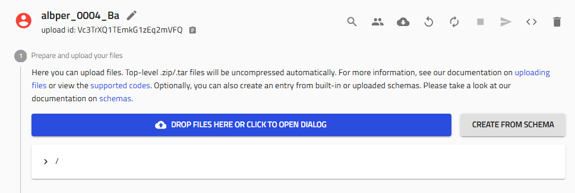
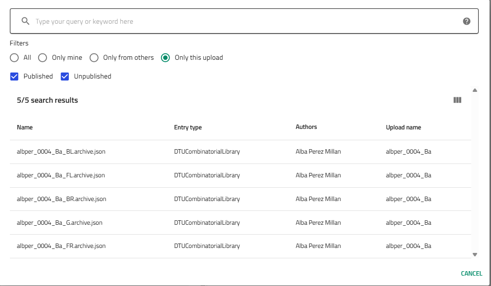

# Plot Combinatorial EDX Data

This guide shows you how to visualize composition data across your entire combinatorial library by combining EDX measurements from multiple quarters into unified plots.

## Overview

After measuring EDX on your cleaved library quarters, you can create visualizations showing:

- Full composition gradients across the original library
- Ternary or quaternary composition maps
- Position-resolved elemental distributions
- Interactive plots for exploring composition space

This is accomplished using Jupyter Analysis with pre-built templates.

## Prerequisites

Before creating visualizations, you need:

- **Completed sputtering upload** with combinatorial libraries
- **EDX measurements** uploaded for quarters you want to visualize
  - Minimum: 1 quarter (for single-quarter visualization)
  - Recommended: All 4 quarters (for full library reconstruction)
- **Basic familiarity** with the library positions (BL, BR, FL, FR)

!!! tip "Data Quality"
    Clean invalid EDX data points before creating plots. Bad data points will appear in your visualizations!

## Step 1: Navigate to Your Upload

Go to the **sputtering upload** containing your combinatorial libraries and EDX measurements.

## Step 2: Create Jupyter Analysis Entry

### 2.1 Start Schema Creation

Click **"Create from schema"** in your upload.



### 2.2 Select Jupyter Analysis

1. **Entry name**: Choose a descriptive name
   ```
   username_####_Material_EDX_Visualization
   ```
   Example: `amazing_researcher_0042_CuZn_EDX_Full_Library`

2. **Schema**: Select **"Jupyter Analysis"** from built-in schemas

3. Click **"Create"**


## Step 3: Select Template

### 3.1 Choose the EDX Plotting Template

NOMAD provides pre-built templates for common analysis tasks.

In the template dropdown, select:

**"Full Process Combinatorial Library EDX Plot v1 (By Eugène)"**


This template automatically:

- Combines data from multiple quarters
- Reconstructs the full library geometry
- Creates composition maps
- Generates interactive plots

!!! info "Template Benefits"
    Templates save time by providing tested, working code. You can modify the generated notebook later for custom analysis.

## Step 4: Link Combinatorial Libraries

### 4.1 Navigate to Libraries Section

Scroll down to the **"Libraries"** section in the Jupyter Analysis entry.


### 4.2 Add Library References

You need to link the combinatorial library entries (not the EDX measurement entries).

**For each quarter you measured:**

1. Click the **"+" icon** next to "Libraries" to add a library reference

2. A selector appears - search for your library

3. **Select the combinatorial library** with the appropriate position suffix:
   - `username_####_Material_BL` (back left)
   - `username_####_Material_BR` (back right)
   - `username_####_Material_FL` (front left)
   - `username_####_Material_FR` (front right)

!!! tip "Finding Libraries Quickly"
    - Use the **"Only this upload"** filter to show only your libraries
    - Type part of thename to search
    - Libraries are named with position suffixes matching your quarters


### 4.3 Add All Four Quarters

Repeat the process to add all four libraries (or however many you measured):

```
✓ BL (Back Left)
✓ BR (Back Right)
✓ FL (Front Left)
✓ FR (Front Right)
```



!!! note "Partial Libraries"
    If you only measured some quarters, add only those. The visualization will show the measured regions.

## Step 5: Generate the Notebook

### 5.1 Activate Generation

Scroll back up to the top of the Jupyter Analysis entry.

Find the **"Generate notebook"** toggle and **activate it** (turn it on).


### 5.2 Save to Trigger Generation

**Click "Save"** at the top of the page.

NOMAD will:

1. Validate your library selections
2. Fetch EDX data from the linked quarters
3. Generate a Jupyter notebook using the template
4. Populate it with your specific data

!!! info "Processing Time"
    Notebook generation typically takes 30-60 seconds. You'll see the notebook appear after processing completes.

## Step 6: Launch and Run the Notebook

### 6.1 Access the Notebook

After generation completes, you'll see a **notebook tab** appear in the entry.

Click on the notebook name or the **arrow icon** to the right to open it.


### 6.2 Launch Jupyter

The notebook opens in Jupyter, NOMAD's interactive computation environment.

If prompted, select the **Python kernel**.


### 6.3 Run All Cells

To generate your plots:

1. **Click "Run All"** in the Jupyter menu, or

2. Run each cell sequentially using **Shift+Enter**

The notebook will:

- Load EDX data from all linked quarters
- Combine them into full library coordinates
- Generate composition maps
- Create interactive visualizations
- Display statistical summaries

!!! success "Plots Generated!"
    You should now see composition maps, ternary diagrams, or other visualizations depending on your material system.

## Understanding the Plots

### Typical Visualizations

The template generates several plot types:

**Composition Maps**

- 2D color maps showing elemental distributions
- X and Y axes represent position on the library
- Color intensity represents composition (atomic % or weight %)

**Ternary Diagrams** (for 3-element systems)

- Triangular plots showing three-component compositions
- Each point represents a measurement location
- Useful for identifying phase boundaries

**Line Scans**

- Composition profiles along specific directions
- Shows gradient steepness and composition ranges

**Interactive Plots**

- Hover to see exact compositions
- Zoom and pan to explore details
- Export as images for presentations

### Interpreting Gradients

Your plots reveal:

- **Composition range achieved** - What compositions exist in your library
- **Gradient direction** - How composition varies spatially
- **Target effectiveness** - How well targets created intended gradients
- **Regions of interest** - Where interesting compositions are located

## Customizing the Notebook

### Modifying Parameters

The template notebook contains code cells you can modify:

- **Color maps**: Change visualization colors
- **Plot ranges**: Adjust axis limits
- **Elements displayed**: Select which elements to plot
- **Resolution**: Change interpolation or gridding

### Adding Analysis

You can add new cells to:

- Calculate derived quantities (ratios, gradients, etc.)
- Correlate with other measurements (XRD, optical, etc.)
- Statistical analysis
- Machine learning predictions

!!! tip "Learn by Example"
    Review notebooks from colleagues to see what analyses are possible. Copy useful code cells into your notebook.

## Exporting Results

### Saving Plots

To save high-quality figures for publications:

See the [Export High-Quality Figures](export-high-quality-figures.md) guide for detailed instructions on:

- Setting DPI and resolution
- Choosing vector (SVG) vs. raster (PNG) formats
- Configuring Plotly export options

### Sharing Analysis

Your Jupyter Analysis entry is part of your upload, so:

- Collaborators with access to the upload can view your notebook
- Plots appear in the entry view
- Notebook can be re-run to regenerate plots after data updates

## Troubleshooting

### Notebook doesn't generate

**Problem**: "Generate notebook" toggle doesn't create a notebook

**Solutions**:

- Verify all four library fields are filled (or expected number)
- Check that libraries exist and are accessible
- Ensure template is selected
- Try saving again after a moment
- Refresh the page and check if notebook appeared

### No data appears in plots

**Problem**: Plots are empty or show no data points

**Solutions**:

- Verify EDX measurements exist for the linked quarters
- Check that EDX entries have data in "Results" sections
- Ensure EDX measurements link to the correct quarters
- Confirm library names match between EDX and libraries added here

### Plots show gaps or missing quarters

**Problem**: Only some quarters appear in visualizations

**Solutions**:

- Verify you added all four libraries (if you measured all four)
- Check that EDX data exists for missing quarters
- Ensure quarter names are consistent (BL, BR, FL, FR)
- Review EDX entries for the missing quarters

### Jupyter is stuck on "Launching"

**Problem**: Jupyter interface doesn't load

**Solutions**:

See the [Troubleshoot Jupyter](troubleshoot-jupyter.md) guide for detailed solutions.

Quick fix:

- Wait 2-3 minutes (initial launch can be slow)
- Refresh the page
- Check server status with NOMAD support

### Error running notebook cells

**Problem**: Code cells show errors when executed

**Solutions**:

- Check if required Python packages are installed
- Verify data format matches expected structure
- Read error messages carefully - they often indicate the issue
- Ask colleagues if they encountered similar errors
- Contact the template author (check notebook comments)

## Next Steps

After visualizing your EDX data:

1. **Identify compositions** of interest for further study
2. **Correlate with other measurements**:
   - Overlay XRD phase maps
   - Compare with optical properties
   - Link to electrical measurements
3. **Prepare figures** for presentations or publications
4. **Document findings** in your lab notebook
5. **Share results** with collaborators

## Related Resources

- [Add EDX Measurements](add-edx-measurements.md) - Upload EDX data
- [Export High-Quality Figures](export-high-quality-figures.md) - Save publication-ready plots
- [Jupyter Analysis Reference](../reference/analysis.md) - Advanced analysis techniques
- [Combinatorial Libraries](../explanation/combinatorial-libraries.md) - Understanding the data model

## Need Help?

If you encounter issues:

- Ask colleagues who have created similar plots
- Review example Jupyter Analysis entries in your group
- Check if your template version is up to date
- Contact the template maintainer (often listed in notebook)
- Reach out to DTU Nanolab NOMAD support
