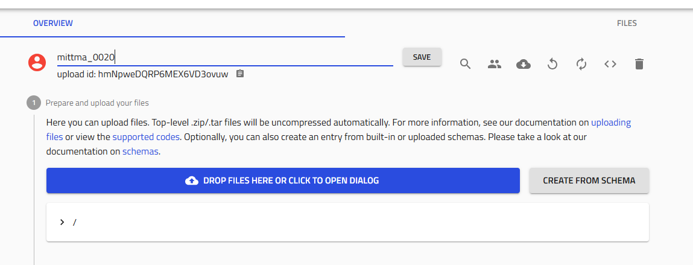
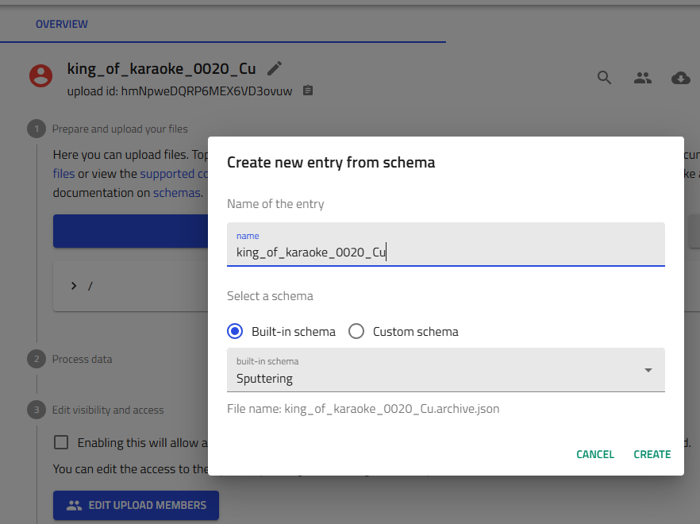
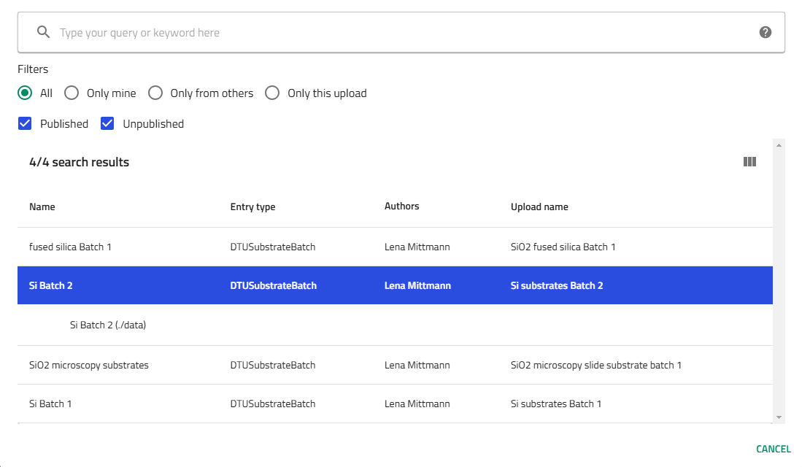
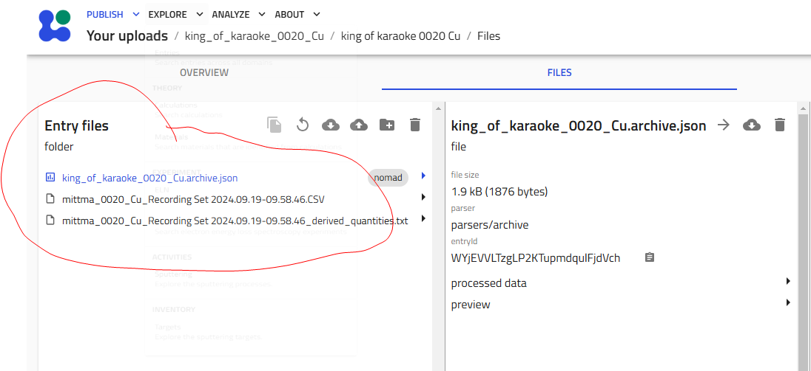
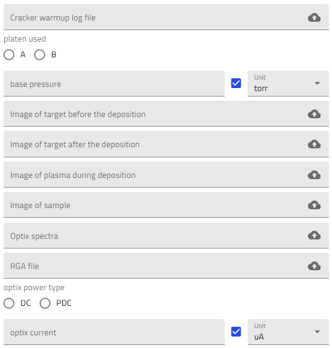

# Upload Sputtering Data

This guide provides complete instructions for uploading sputtering deposition data to NOMAD Oasis. By the end, you'll have a structured entry linking your process parameters, substrates, and combinatorial libraries.

## Prerequisites

Before starting, gather:

- **Deposition logfile** - CSV file from the Lesker sputtering system
- **Deposition details**:
  - Unique deposition ID
  - Substrate positions (FL, FR, BL, BR for silicon; G for glass)
  - Substrate batch numbers
  - Base pressure
  - Platen ID (A or B)
- **Optional files**:
  - Cracker warmup file
  - Process photos
  - Optix spectra
  - RGA (Residual Gas Analyzer) file
  - Lab notebook comments

## Step 1: Create the Upload

### 1.1 Create a New Upload

1. Navigate to your NOMAD Oasis dashboard

2. Click **"New Upload"**

### 1.2 Name Your Upload

Use your lab's naming convention for the deposition ID:

```
username_####_Material(s)
```

Examples:

- `amazingresearcher_0042_Cu`
- `username_0123_Ba-Zr`
- `initials_0001_Ag`



!!! warning "Important"
    This name becomes permanent and is used throughout the system. Double-check spelling and format!

Click **"Save"**.

### 1.3 Share with Your Group

Collaboration is key! Share the upload with your research group:

1. Click the **"Edit upload members"** icon (two people icon) next to the Save button

   

2. Add members:
   - **Co-authors**: Full editing privileges (recommended for group members)
   - **Reviewers**: View-only access

3. Add **"Thin-Film Materials Discovery"** group as co-author

!!! tip "Group Access"
    Adding the group ensures data visibility and enables collaborative analysis.

## Step 2: Create the Sputtering Entry

### 2.1 Access Schema Creator

In your upload, click **"Create from schema"**.

### 2.2 Select Sputtering Schema

1. **Entry name**: Enter the same deposition ID you used for the upload

2. **Schema dropdown**: Select **"Sputter Deposition"** or **"Sputtering"** from built-in schemas

3. Click **"Create"**




!!! danger "Cannot Change Entry Name"
    The entry name is saved as a permanent .json file. Verify it's correct before creating!

## Step 3: Add Substrates

Substrates are the foundation of your combinatorial libraries. You'll typically deposit on 5 substrates: four silicon wafers (one per corner) and one glass substrate.

### 3.1 Add Substrate Entries

Click the **"+" icon** next to "Substrates" **five times** to create 5 substrate entries.

   

### 3.2 Configure Each Substrate

For **each** of the 5 substrates:

1. **Click on the substrate** in the list to open its configuration

2. **Select substrate batch**:
   - For **silicon**: Choose the specific batch from available options (multiple batches exist)
   - For **glass**: Only one glass option typically available


   
   

3. **Choose position**:
   - **FL** - Front Left
   - **FR** - Front Right
   - **BL** - Back Left
   - **BR** - Back Right
   - **G** - Glass (Bottom Center)

   

4. **Click "Save"** - Critical! Save after configuring each substrate

!!! warning "Save After Each Substrate"
    Failing to save between substrates may result in data loss. The system doesn't auto-save in this interface. Make sure that each substrate entry references a different substrate from the selected batch.

## Step 4: Upload the Logfile

The Lesker CSV logfile contains timestamped process parameters.

### 4.1 Upload the File

1. Locate the **Log file** field in the sputtering entry

2. **Drag and drop** your CSV file, or click to browse

   

3. **Click "Save"** immediately after upload

!!! info "What happens during processing"
    NOMAD parses the logfile to extract:

    - Deposition parameters
    - Target power settings
    - Gas flows
    - Temperature profiles

### 4.2 Optional: Add Supporting Files

You can add additional files to provide complete documentation:

1. Navigate to the **"Files"** tab in your upload

2. **Drag and drop** files into the "Entry files" area:
   - Cracker warmup data (CSV file including the temperature profile of the Scracker temperature ramp up)
   - Photos of the target before and after deposition, photo of the plasma during deposition and of the samples after deposition
   - Optical raw spectra (from the Optix optical emission spectroscope)
   - RGA traces (processed spectra showing gas partial pressure vs. time)
   - Operation parameters for the Optix plasma (current and power type, DC or PDC)
   - Flags can be added to the sputtering entry if a specific event has occurred and needs to be reported (unstable target, interrupted deposition, etc)
   - Any other relevant documentation can be added in the description field, or as files in the corresponding upload




!!! tip "File Organization"
    While not required, additional files help with reproducibility and troubleshooting.

## Step 5: Fill in Process Details

Complete the remaining process metadata manually.

### 5.1 Required Information

Fill in these fields:

- **Cracker warmup file**: Upload or reference if used
- **Platen ID**: Select A or B (which heater platen was used)
- **Base pressure**: If not already automatically extracted by the parser, enter value manually (typically 10^-7 torr)
- **Process comments**: Copy notes from your lab notebook in the description field.



### 5.2 Optional Documentation

If available, add:

- **Process photos**: Images of the chamber, samples, or setup
- **Description**: Any additional information that does not fit anywhere else

### 5.3 Save Your Work

Click **"Save"** at the top of the page to commit all changes.

## Step 6: Verify the Upload

After processing completes (typically 10s), verify your upload created the correct entries.

### 6.1 Expected Entry Count

The upload should contain **exactly (2 × number of substrates) + 1 entries**:

- **1 sputtering process entry** - The main deposition record
- **2 entries per substrate**:
  - Combinatorial library entry (the deposited film on that substrate)
  - Layer entry

**Example calculations:**

- 5 substrates: (2 × 5) + 1 = **11 entries** ✓
- 4 substrates: (2 × 4) + 1 = **9 entries** ✓

### 6.2 Verify Combinatorial Libraries

Each combinatorial library should:

- Be named based on the combination of the sputtering run name and the substrate location on the platen (e.g., `user_0042_Cu_BL`)
- Link to the correct substrate batch
- Reference the sputtering process
- Show target composition and deposition parameters

!!! success "Upload Complete!"
    If verification passes, your sputtering data is successfully uploaded! You can now proceed to cleaving and characterization.

## Troubleshooting

### Wrong number of entries created

**Problem**: Not seeing (2 × substrates) + 1 entries

**Solutions**:

- Check if all substrates were saved individually
- Verify the logfile uploaded successfully
- Wait for processing to complete (check upload status)
- If entries are missing, recreate the affected substrates

### Logfile won't upload

**Problem**: CSV file rejected or errors during upload

**Solutions**:

- Verify it's the Lesker CSV format (not Excel or other format)
- Check file isn't corrupted (open in a text editor to verify)
- Ensure file size is reasonable (<10 MB typically)
- Try uploading from a different browser

### Can't find substrate batch

**Problem**: Expected substrate batch doesn't appear in dropdown

**Solutions**:

- Check if the batch was previously created in NOMAD
- Ask colleagues if the batch exists under a different name
- If it's a new batch, it needs to be created first (see [Substrates reference](../reference/substrates.md))

### Entry name typo

**Problem**: Made a typo in the sputtering entry name

**Solutions**:

- Unfortunately, entry names are permanent
- You can:
  - Continue with the typo (use it consistently throughout)
  - Delete the entry and create a new one (lose subsections if already filled)
  - Contact admin to manually rename in database (not recommended)

!!! warning "Prevention is Key"
    Always double-check names before clicking "Create"!

## Next Steps

After successfully uploading sputtering data:

1. **[Cleave Libraries](cleave-libraries.md)** - Divide substrates for different characterization
2. **[Add EDX Measurements](add-edx-measurements.md)** - Upload composition data
3. **[Add XRD Measurements](add-xrd-measurements.md)** - Upload structural data
4. **[Add Ellipsometry Measurements](add-ellipsometry-measurements.md)** - Upload optical properties
5. **[Add RTP Data](add-rtp-data.md)** - If you performed thermal processing

## Related Resources

- [Getting Started with Schemas](getting-started-with-schemas.md) - Learn schema basics
- [Sputtering Reference](../reference/sputtering.md) - Detailed field documentation
- [Tutorial](../tutorial/tutorial.md) - Follow complete workflow example

## Questions?

If you encounter issues not covered here:

- Ask experienced group members
- Check the [Reference Documentation](../reference/index.md)
- Contact DTU Nanolab NOMAD support
