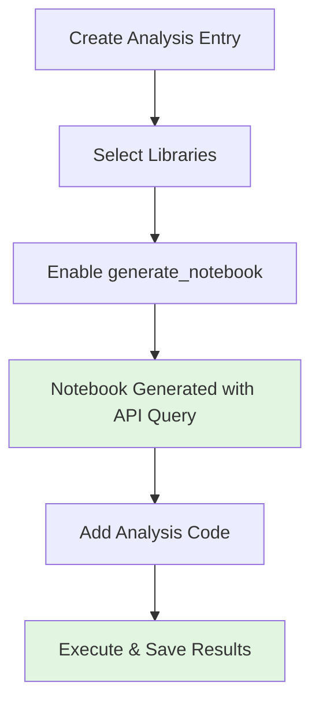
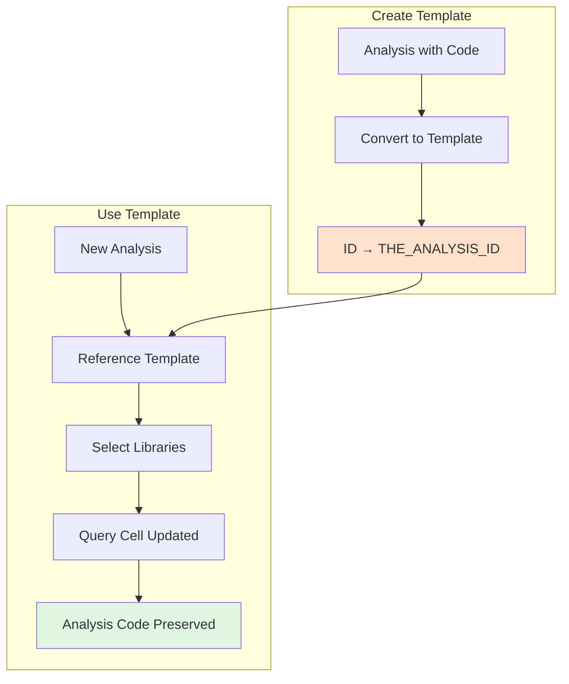

# Jupyter Analysis

Python-based analysis workflows using Jupyter notebooks, integrated directly into NOMAD with full provenance tracking.

## Overview

Two complementary approaches for notebook-based analysis:

- **DtuJupyterAnalysis** - Auto-generated notebooks that fetch data from selected NOMAD entries
- **DtuJupyterAnalysisTemplate** - Reusable templates with complex analysis code that can be applied to different datasets

Both provide provenance tracking from samples through measurements to results.

---

## Basic Jupyter Analysis

Create analysis entries through an ELN form:

- Select libraries/measurements using the `libraries` field
- Check `generate_notebook` to auto-create a pre-filled Jupyter notebook
- Generated notebook includes API query to fetch selected entries' data

### ELN Form Interface


### Generated API Query Cell


```python
from nomad.client import ArchiveQuery
from nomad.config import client

analysis_id = "THE_ANALYSIS_ID"
a_query = ArchiveQuery(
    query={'entry_id:any': [analysis_id]},
    required='*',
    url=client.url,
)
entry_list = a_query.download()
analysis = entry_list[0].data
```

The `analysis_id` is automatically replaced with the actual entry ID when the notebook is generated.

### Workflow



---

## Templated Jupyter Analysis

Reusable templates for complex analysis code (visualizations, ML models, statistical analysis).

### Key Concept

Templates enable **reusing sophisticated analysis code with different data sources**:

1. **Template Creation**: Convert existing analysis → Replace `analysis_id` with `"THE_ANALYSIS_ID"` placeholder → Store template
2. **Template Instantiation**: Reference template → Select new libraries → Only API query cell is updated → All analysis code preserved

### Template Workflow



### What Gets Templated

| Component | Template | Instance |
|-----------|----------|----------|
| **API Query Cell** | `"THE_ANALYSIS_ID"` placeholder | Actual entry ID |
| **Analysis Code** | Preserved | Preserved |
| **Visualizations** | Preserved | Runs on new data |
| **ML Models** | Preserved | Runs on new data |

**Key**: Only the data source changes; all analysis logic is reused.

### Use Cases

- Complex visualizations (ternary plots, heatmaps) with consistent styling
- ML inference with pre-trained models on new data
- Standardized statistical analysis across sample sets
- Publication-ready figures with uniform formatting

---

## Benefits

- **Reproducible**: Code and data together in NOMAD
- **Provenance**: Full traceability from raw data to results
- **Reusable**: Templates standardize analysis across datasets
- **Searchable**: Notebooks are searchable NOMAD entries
- **Bidirectional linking**: Analysis ↔ source data connections

---

## Related Schemas

- **Input data**: [XRD](xrd.md), [XPS](xps.md), [EDX](edx.md), [PL](pl.md), [Ellipsometry](ellipsometry.md), [Raman](raman.md), [RT](rt.md)
- **Analyzed samples**: [Samples](samples.md)
- **Synthesis context**: [Sputtering](sputtering.md), [RTP](rtp.md), [Thermal Evaporation](thermal.md)

---

## Schema Documentation

{{ metainfo_package('nomad_dtu_nanolab_plugin.schema_packages.analysis') }}
