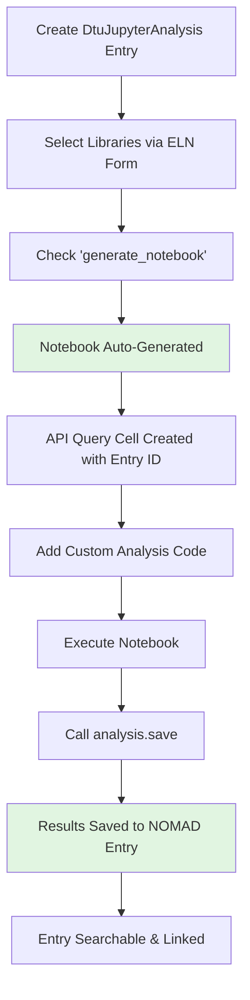
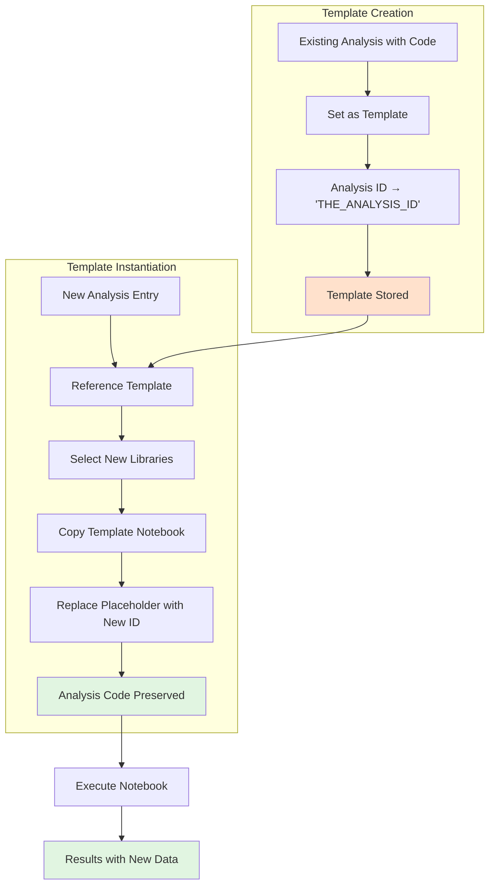

# Jupyter Analysis

Computational analysis and data processing workflows using Jupyter notebooks. This schema integrates Python-based analysis directly into NOMAD, enabling reproducible data processing with full provenance tracking.

## Overview

The DTU Nanolab plugin provides two complementary approaches for Jupyter notebook-based analysis:

- **DtuJupyterAnalysis** - Create analysis entries with auto-generated notebooks that fetch data from selected NOMAD entries
- **DtuJupyterAnalysisTemplate** - Create reusable notebook templates with sophisticated analysis code (ML models, advanced visualizations) that can be instantiated with different data sources

Both extend NOMAD's `Analysis` and `Activity` base classes, providing full provenance tracking from samples through measurements to analysis results.

---

## Basic Jupyter Analysis

The `DtuJupyterAnalysis` class allows you to create analysis entries through an ELN (Electronic Lab Notebook) form where you can:

- Select one or more library entries or measurements from your NOMAD database using the `libraries` field
- Check the `generate_notebook` checkbox to automatically create a pre-filled Jupyter notebook
- The generated notebook includes an API query that automatically fetches all selected entries' data

### ELN Form Interface


*The ELN form showing key fields: name, template selection, libraries references, and the generate_notebook checkbox*

### Generated API Query Cell

When you enable `generate_notebook`, NOMAD automatically creates a notebook with a standardized query cell:


```python
from nomad.client import ArchiveQuery
from nomad.config import client

analysis_id = "THE_ANALYSIS_ID"
a_query = ArchiveQuery(
    query={'entry_id:any': [analysis_id]},
    required='*',
    url=client.url,
)
entry_list = a_query.download()
analysis = entry_list[0].data
```

This cell:

- Fetches the analysis entry from NOMAD by its unique ID
- Downloads all its data including linked libraries
- Makes everything available through the `analysis` variable
- Gets automatically updated with the correct `analysis_id` when the entry is created

### Workflow



### Key Features

- **Manual library selection**: Choose exactly which entries to analyze through the ELN interface
- **Automatic data fetching**: The generated query cell retrieves all selected data
- **Bidirectional linking**: Analysis entries link to source data; source data can reference analyses
- **Searchable**: Analysis notebooks become searchable entries in NOMAD
- **Provenance**: Full traceability from raw data through analysis to results

---

## Templated Jupyter Analysis

The `DtuJupyterAnalysisTemplate` class enables creation of reusable analysis templates containing sophisticated, pre-written analysis code such as:

- Complex visualizations (ternary plots, heatmaps, 3D plots)
- Machine learning models (training, inference, predictions)
- Statistical analysis and cross-correlations
- Domain-specific analysis workflows

### The Template Concept

Templates solve a key challenge: **reusing complex analysis code with different data sources**.

When you create a template:

1. Start with a complete `DtuJupyterAnalysis` with sophisticated analysis code
2. Convert it to a template where the specific `analysis_id` is replaced with a placeholder: `"THE_ANALYSIS_ID"`
3. Store the template for reuse

When you instantiate from a template:

1. Create a new `DtuJupyterAnalysis` and reference the template
2. Select your new set of libraries to analyze
3. NOMAD copies the template notebook and **only replaces the API query cell** with your new analysis ID
4. **All the sophisticated analysis code remains unchanged**

### Template Workflow



### What Gets Templated vs. Regenerated

| Component | Template Behavior | Instance Behavior |
|-----------|------------------|-------------------|
| **API Query Cell** | `analysis_id = "THE_ANALYSIS_ID"` | Replaced with actual entry ID |
| **Analysis Code** | Preserved exactly as-is | Preserved exactly as-is |
| **Visualizations** | Preserved (ternary plots, heatmaps, etc.) | Preserved (plots new data) |
| **ML Models** | Preserved (training/inference logic) | Preserved (runs on new data) |
| **Data Processing** | Preserved (normalization, filtering) | Preserved (processes new data) |

**Key Insight**: Only the data source changes; all analysis logic is reused.

### Example Use Case: Ternary Phase Diagrams

A perfect example of template utility is analyzing compositional data:

<iframe src="../assets/ternary-plot-example.html" width="100%" height="650px" frameborder="0"></iframe>

*Interactive ternary plot showing elemental composition distribution across combinatorial libraries*

The [example template notebook](../examples/ternary_plot_template.ipynb) demonstrates:

- Fetching EDX and XRD data from library entries
- Normalizing elemental compositions (accounting for oxygen)
- Creating interactive plotly ternary diagrams
- Color-coding by synthesis parameters (temperature, sample number, etc.)
- Saving results back to NOMAD

**Why this benefits from templates**:

- The ternary plot code is complex (30+ lines)
- Normalization logic needs to be consistent
- Visual styling should be standardized
- Only the data source (which libraries) changes between analyses

By using a template, you ensure every analysis uses the same proven plotting code, while simply pointing it at different datasets.

### Additional Template Examples

Templates excel for:

- **Cross-correlation analysis**: Fixed statistical methods applied to different sample sets
- **ML inference**: Pre-trained models making predictions on new experimental data  
- **Publication-ready figures**: Standardized visualization styles across multiple analyses
- **Complex workflows**: Multi-step pipelines (data cleaning → feature extraction → modeling → visualization)

### Creating and Using Templates

**To create a template**:

1. Create a complete `DtuJupyterAnalysis` with your analysis code
2. Create a new `DtuJupyterAnalysisTemplate` entry
3. Reference your source analysis in the `copy_from_analysis` field
4. Enable `generate_from_analysis`
5. The system converts your notebook to a template

**To use a template**:

1. Create a new `DtuJupyterAnalysis` entry
2. Reference your template in the `template` field
3. Select your libraries in the `libraries` field
4. Enable `generate_notebook`
5. The system creates a notebook from your template with updated data queries

---

## What Jupyter Analysis Enables

- **Reproducible analysis**: Code and data together in NOMAD
- **Provenance tracking**: From raw data through analysis to results
- **Sharing**: Collaborators can see exactly how results were obtained
- **Reanalysis**: Easy to rerun with different parameters or data
- **Reusability**: Templates enable standardized analysis across datasets
- **Searchability**: Analysis code and results are searchable in NOMAD
- **Living documentation**: Notebooks serve as executable documentation

---

## Related Schemas

- **Input data**: [XRD](xrd.md), [XPS](xps.md), [EDX](edx.md), [PL](pl.md), [Ellipsometry](ellipsometry.md), [Raman](raman.md), [RT](rt.md)
- **Analyzed samples**: [Samples](samples.md)
- **Synthesis context**: [Sputtering](sputtering.md), [RTP](rtp.md), [Thermal Evaporation](thermal.md)

---

## Schema Documentation

{{ metainfo_package('nomad_dtu_nanolab_plugin.schema_packages.analysis') }}

---

## Schema Documentation

{{ metainfo_package('nomad_dtu_nanolab_plugin.schema_packages.analysis') }}
