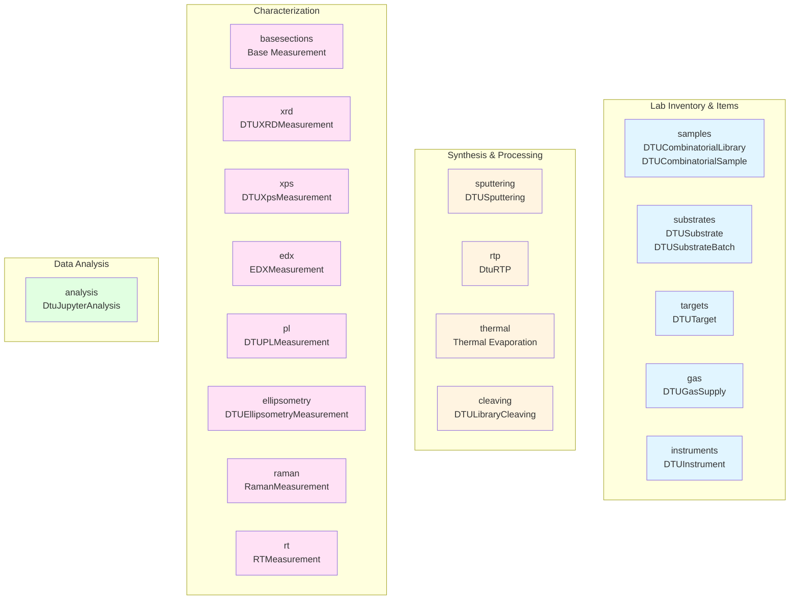
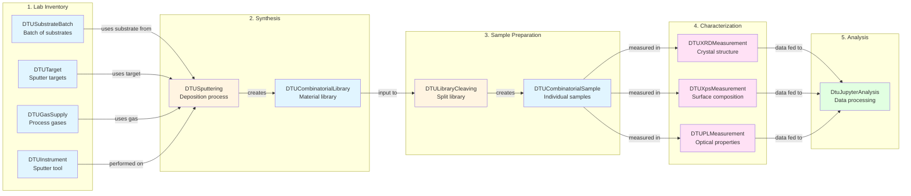

# Schema Reference Overview

This section provides complete technical documentation for all data models in the nomad-dtu-nanolab-plugin. These schemas capture the materials discovery workflow at DTU Nanolab, from managing lab inventory to synthesizing samples to performing characterization measurements.

## Understanding the Data Organization

The schemas are organized following practical lab workflows, built from [NOMAD base sections](https://nomad-lab.eu/prod/v1/staging/docs/explanation/base_sections.html#datamodelmetainfobasesections) with a foundation from the [Basic Formal Ontology (BFO)](https://basic-formal-ontology.org/){:target="_blank" rel="noopener"}. Don't worry—you don't need to understand formal ontology to use these schemas! Here's what it means in practice:

### Entities: Physical Items in Your Lab

**Entities** are things that exist and persist over time—the physical items you handle in the lab:

- **Samples and Libraries** - The materials you create and study ([DTUCombinatorialLibrary](samples.md), [DTUCombinatorialSample](samples.md))
- **Substrates** - The base materials you deposit on ([DTUSubstrate](substrates.md), [DTUSubstrateBatch](substrates.md))
- **Targets** - Sputter deposition sources ([DTUTarget](targets.md))
- **Gas Supplies** - Gas cylinders and supplies ([DTUGasSupply](gas.md))
- **Instruments** - Equipment in your lab ([DTUInstrument](instruments.md))

These all extend NOMAD's `Entity` base class, which provides common functionality like lab IDs, references, and searchability.

### Activities: Things You Do in the Lab

**Activities** are processes, measurements, and analyses—the actions you perform:

- **Synthesis Processes** - Making samples ([DTUSputtering](sputtering.md), [DtuRTP](rtp.md), [Thermal Evaporation](thermal.md))
- **Sample Processing** - Splitting libraries ([DTULibraryCleaving](cleaving.md))
- **Measurements** - Characterization techniques ([XRD](xrd.md), [XPS](xps.md), [EDX](edx.md), [PL](pl.md), [Ellipsometry](ellipsometry.md), [Raman](raman.md), [RT](rt.md))
- **Analysis** - Data processing and interpretation ([DtuJupyterAnalysis](analysis.md))

These extend NOMAD's `Activity` base classes (`Process`, `Measurement`, `Analysis`), which provide workflow integration, datetime tracking, and result normalization.

## Schema Package Organization

The plugin contains 17 schema packages organized by function:

## Example: End-to-End Materials Discovery Workflow

Here's how these schemas connect in a typical DTU Nanolab workflow, from inventory to analysis:

## Navigation Guide

### By Lab Activity

**Managing inventory?** → [Lab Inventory & Items](#lab-inventory-items)

**Synthesizing samples?** → [Synthesis & Processing](#synthesis-processing)

**Characterizing materials?** → [Characterization](#characterization)

**Analyzing data?** → [Data Analysis](#data-analysis)

### By Schema Type

All schemas are listed in the navigation menu organized by their role in the materials discovery workflow. Each page provides:

- Practical context for when and how to use the schema
- Complete auto-generated technical documentation
- Links to related schemas

## Lab Inventory & Items

Physical items managed in the lab:

- **[Samples and Libraries](samples.md)** - Combinatorial libraries and individual samples created from synthesis or cleaving
- **[Substrates](substrates.md)** - Base materials for deposition, tracked in batches
- **[Targets](targets.md)** - Sputter deposition source materials with composition and power tracking
- **[Gas Supplies](gas.md)** - Gas cylinders with cylinder numbers and supply management
- **[Instruments](instruments.md)** - Laboratory equipment with capabilities and configurations

## Synthesis & Processing

Fabrication and sample preparation processes:

- **[Sputtering Deposition](sputtering.md)** - Multi-target sputter deposition with power, pressure, and gas control
- **[Rapid Thermal Processing (RTP)](rtp.md)** - Thermal annealing and treatment processes
- **[Thermal Evaporation](thermal.md)** - Vacuum deposition via thermal evaporation
- **[Library Cleaving](cleaving.md)** - Splitting combinatorial libraries into individual samples

## Characterization

Measurement techniques for materials characterization:

- **[Base Measurement Infrastructure](basesections.md)** - Common functionality shared by all DTU measurements
- **[X-ray Diffraction (XRD)](xrd.md)** - Crystal structure and phase identification
- **[X-ray Photoelectron Spectroscopy (XPS)](xps.md)** - Surface composition and chemical states
- **[Energy-Dispersive X-ray Spectroscopy (EDX)](edx.md)** - Elemental composition mapping
- **[Photoluminescence (PL)](pl.md)** - Optical emission and bandgap characterization
- **[Ellipsometry](ellipsometry.md)** - Optical constants and film thickness
- **[Raman Spectroscopy](raman.md)** - Vibrational modes and material fingerprinting
- **[RT Measurements](rt.md)** - Room temperature electrical and optical measurements

## Data Analysis

Computational analysis and data processing:

- **[Jupyter Analysis](analysis.md)** - Python-based data analysis workflows with notebook integration

---

## Additional Resources

- [NOMAD Documentation](https://nomad-lab.eu/prod/v1/docs/){:target="_blank" rel="noopener"} - Main NOMAD platform documentation
- [Basic Formal Ontology](https://basic-formal-ontology.org/){:target="_blank" rel="noopener"} - Ontological foundation for the data model
- [Tutorial > ... > Use this Plugin](../tutorial/tutorial.md) - Step-by-step guides for getting started
- [How-to Guides > ... > Use this Plugin](../how_to/use_this_plugin.md) - Practical usage instructions

## Adapting for Your Lab

These schemas are designed for DTU Nanolab's Materials Discovery group but can serve as a template for similar labs. The key principles:

1. **Entities (physical items)** should have unique IDs and be referenceable
2. **Activities (processes/measurements)** should link to their input entities and output entities
3. **Measurements** should link to samples and instruments
4. **Analysis** should link to the measurements providing input data

The BFO-based structure ensures consistency and enables powerful data queries across your entire research workflow.
