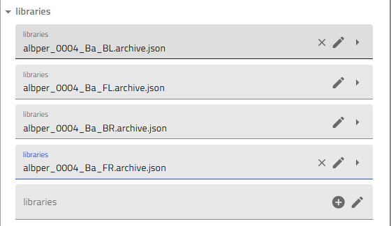

# Your First Combinatorial Materials Discovery Project

Welcome to the DTU Nanolab NOMAD plugin! This tutorial will guide you through a complete combinatorial materials discovery workflow, from depositing your first thin-film library to visualizing characterization results.

## What You'll Learn

By the end of this tutorial, you'll know how to:

- Navigate NOMAD schemas and create structured data entries
- Upload sputtering deposition data and link substrates
- Cleave combinatorial libraries into quarters for characterization
- Add EDX characterization measurements
- Visualize composition data across your entire library

## Prerequisites

Before starting, make sure you have:

- Access to the DTU Nanolab NOMAD Oasis deployment
- A sputtering deposition logfile (CSV format)
- Basic familiarity with your experimental workflow

!!! tip "Time commitment"
    This tutorial takes approximately 30-45 minutes to complete. You can pause at any step and return later.

## Step 1: Understanding NOMAD Schemas

NOMAD organizes your experimental data using **schemas** - structured templates that ensure consistency and enable powerful search capabilities. Let's explore how schemas work using a simple example.

### Creating Your First Schema Entry

1. **Create a new upload** in NOMAD Oasis

2. **Click the "Create from schema" button** (gray button in the upload interface)

   

3. **Fill in the entry details:**
   - In the text field, enter a descriptive process name
   - From the dropdown menu, select the appropriate schema (e.g., "Bell Jar Evaporator")

   

4. **Navigate the schema interface:**

   You'll see an interface with editable fields (shown in gray) and collapsible subsections.

   

### Working with Subsections

Schemas contain **subsections** that organize related information. These are indicated by gray "+" icons.

- **Click the "+" icon** next to a subsection (e.g., "Steps") to add details

  

- **Nested subsections** provide even more detail:

  

!!! info "Single vs. Multiple Instances"
    - **Single instance subsections**: The "+" icon disappears after creating one instance (e.g., "Environment")
    - **Multiple instance subsections**: The "+" icon remains, allowing you to add multiple entries (e.g., multiple "Steps")

    

### Viewing Multiple Instances

When you create multiple instances of a subsection, they appear in a list. Click the subsection name to expand and see all instances. Each entry shows either its custom name or a consecutive number.


!!! success "Key Takeaway"
    Schemas provide structured, reproducible data entry. The hierarchical organization (sections → subsections → fields) mirrors your experimental workflow.

For more detailed information about schema navigation, see the [Understanding Schemas](../how_to/getting-started-with-schemas.md) guide.

## Step 2: Upload Your Sputtering Deposition

Now let's apply what you've learned to upload a real sputtering deposition. This is the foundation of your combinatorial library.

### Prepare Your Data

Before starting, locate your deposition logfile (CSV format from the Lesker system). You'll also need to know:

- Deposition ID (e.g., `username_0001_Cu`)
- Substrate positions (FL, FR, BL, BR for silicon; G for glass)
- Substrate batch numbers
- Base pressure and other process parameters

### Create the Upload

1. **Create a new upload** and name it with your deposition ID (e.g., `username_0001_Cu`)

2. **Share with your group:**
   - Click the "Edit upload members" icon (two people icon)
   - Add "Thin-Film Materials Discovery" as co-author
   - Add collaborators as needed

3. **Create from schema:**
   - Click "Create from schema"
   - Select **"Sputtering"** from the built-in schemas
   - Enter the same deposition ID as the entry name

   !!! warning "Important"
       The entry name becomes permanent (stored as a .json file), so double-check it before creating!


### Add Substrates

4. **Add your substrates:**
   - Click the "+" icon to add substrates (typically 5: four silicon + one glass)
   - For each substrate:
     - Click on it to open the configuration
     - Select the substrate batch (multiple options for silicon, single option for glass)
     - Choose the position: FL (Front Left), FR (Front Right), BL (Back Left), BR (Back Right), or G (Glass)
     - **IMPORTANT: Click "Save" after each substrate definition (after choosing batch and position)**

   
   
   

### Upload Process Data

5. **Upload the Lesker CSV logfile:**
   - Drag and drop your logfile into the designated area
   - **Click "Save"**

   

6. **Fill in additional process details:**
   - Cracker warmup file
   - Platen ID (A or B)
   - Base pressure
   - Process photos
   - Optix spectra
   - RGA file
   - Copy comments from your lab notebook into the free text field

### Verify Your Upload

After processing, verify the upload created the correct number of entries:

!!! success "Verification Check"
    You should have **(2 × number of substrates) + 1** entries total:

    - 1 sputtering process entry
    - 2 entries per substrate (layer + combinatorial library)

    For example, with 5 substrates: (2 × 5) + 1 = **11 entries total**

For complete details and troubleshooting, see the [Upload Sputtering Data](../how_to/upload-sputtering-data.md) guide.

## Step 3: Cleave Your Combinatorial Library

Your silicon substrates contain composition gradients that need to be divided for different characterization techniques. The cleaving process creates "child libraries" - smaller pieces with tracked positions.

### Start the Cleaving Process

1. **In your sputtering upload**, click "Create from schema"

2. **Select "Library Cleaving"** and name it following the convention:
   ```
   username_####_Material-Material_Position_Breaking
   ```
   Example: `amazing_researcher_0042_Cu-Zn_BL_Breaking`

3. **Select the parent library:**
   - Choose the combinatorial library you want to cleave (e.g., Back Left position)
   - Click "Fetch library size" to auto-fill dimensions, or enter manually

### Generate the Cleaving Pattern

4. **Choose your cleaving pattern** from the dropdown menu (typically "Four Quarters")

5. **Note the number of cleaved pieces** (usually 4)

6. **Click "Generate pattern"** to visualize the cleaving layout

7. **Review the pattern** in the figure at the bottom - ensure it matches your intended cleaving

### Create Child Libraries

8. **Click "Create child libraries"** to generate the individual pieces

9. **Scroll down** to see the schematic showing all cleaved pieces with their relative positions

!!! info "Why cleave?"
    Different characterization techniques (EDX, XRD, XPS, etc.) require dedicating substrate pieces. Cleaving in NOMAD maintains the relationship between each piece and its original position in the composition gradient.

For more details about cleaving patterns and troubleshooting, see the [Cleave Libraries](../how_to/cleave-libraries.md) guide.

## Step 4: Add Characterization Data (EDX Example)

After cleaving, you'll measure composition using Energy-Dispersive X-ray Spectroscopy (EDX). Let's add this data to your combinatorial library.

!!! note "Prerequisites"
    You'll need Excel files from your EDX measurement - one file per quarter/piece measured.

### Create an EDX Measurement Entry

1. **Go to your sputtering upload**

2. **Click "Create from schema"**

3. **Select "EDX Measurement"** from built-in schemas

4. **Name your entry** following the convention:
   ```
   username_####_Material_Quarter_EDX
   ```
   Example: `amazingresearcher_0042_CuZn_BR_EDX`

   

### Upload Your EDX Data

5. **Upload the Excel file:**
   - In the "EDX file" field, upload your Excel file
   - **Click "Save"** (very important!)

   

### Review and Clean Data

6. **Scroll down to the "Results" subsection**

7. **Review the auto-generated graphs** showing all measurement points

   

8. **Remove bad data points** if needed:
   - Use the trash can icon to delete points where you hit substrate or non-film areas
   - **Click "Save"** after each deletion

   

!!! tip "Multiple quarters"
    If you mapped all four quarters, repeat this process for each one (BR, BL, FL, FR), creating separate EDX measurement entries.

### Adding XRD Data

The process for XRD is similar! See the [Add XRD Measurements](../how_to/add-xrd-measurements.md) guide for detailed instructions.

## Step 5: Visualize Your Full Library

Now for the exciting part - seeing composition data across your entire library! We'll use Jupyter Analysis to create visualizations.

### Create a Jupyter Analysis Entry

1. **In your sputtering upload**, click "Create from schema"

2. **Select "Jupyter Analysis"** and give it a descriptive name

3. **Choose the template:**
   - Select "Full Process Combinatorial Library EDX Plot v1 (By Eugène)"

   

### Link Your Libraries

4. **Scroll down to the "Libraries" section**

   

5. **Add all four quarters:**
   - Click the "+" icon four times
   - For each quarter, select the corresponding combinatorial library:
     - `username_####_Material_BL`
     - `username_####_Material_BR`
     - `username_####_Material_FL`
     - `username_####_Material_FR`

   !!! tip "Finding libraries"
       Use the "Only this upload" filter to quickly find your libraries

   

### Generate and Run the Notebook

6. **Activate notebook generation:**
   - Scroll up and toggle "Generate notebook"

   

7. **Click "Save"** - the notebook will appear after normalization

8. **Launch Jupyter:**
   - Click the arrow icon next to the notebook name
   - Select Python kernel if asked
   - Run all cells to generate your plots!

   

!!! success "Congratulations!"
    You've completed your first end-to-end combinatorial materials discovery project in NOMAD! You can now see composition gradients across your entire library.

For advanced plotting options and customization, see the [Plot Combinatorial EDX Data](../how_to/plot-combinatorial-edx.md) guide.

## What's Next?

You've learned the core workflow, but there's much more you can do:

### Add More Characterization

- [Add XRD Measurements](../how_to/add-xrd-measurements.md) - Structural characterization
- [Add RTP Data](../how_to/add-rtp-data.md) - Thermal processing steps

### Improve Your Workflows

- [Export High-Quality Figures](../how_to/export-high-quality-figures.md) - Publication-ready plots
- [Troubleshoot Jupyter](../how_to/troubleshoot-jupyter.md) - Fix common Jupyter issues

### Explore the Data Model

- [Data Model Philosophy](../explanation/data-model.md) - Understand the design principles
- [Combinatorial Libraries](../explanation/combinatorial-libraries.md) - Learn about position tracking

### Get Help

If you encounter issues:

- Check the [How-to Guides](../how_to/install_this_plugin.md) for specific tasks
- Review the [Reference Documentation](../reference/index.md) for schema details
- Ask your colleagues or the DTU Nanolab community

Happy experimenting! 🔬
